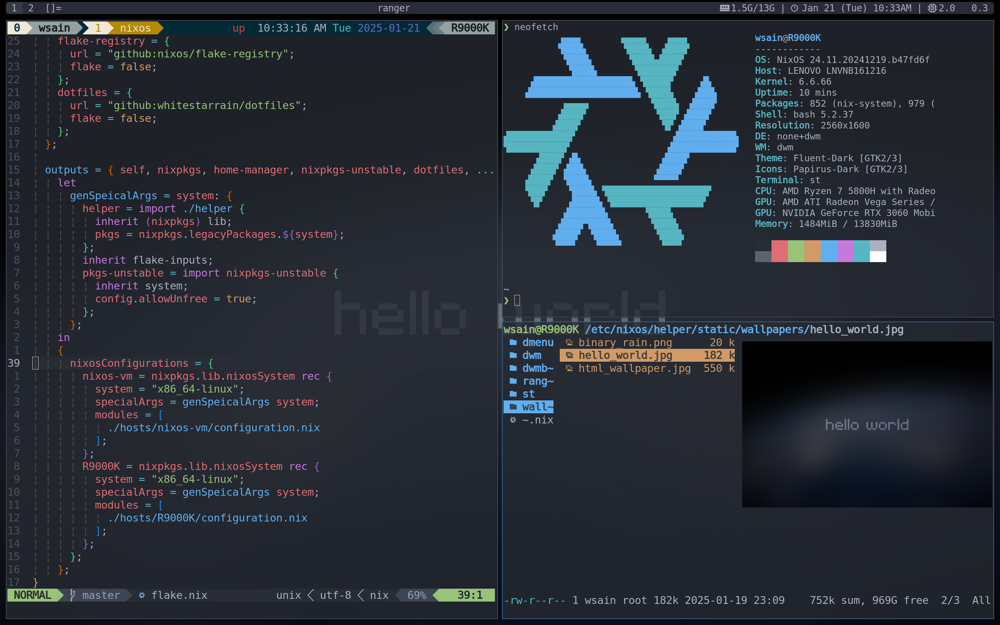

# About

wsain's nixos config

Note: Since nixos-rebuild now does not support git submodules, the configuration below will not be managed by nixos.

- neovim: `~/.config/nvim`
- emacs: `~/.emacs.d`
- tmux: `~/.tmux.conf`
- `~/.bin`

# Reference

- [ryan4yin's nix-config](https://github.com/ryan4yin/nix-config.git)
- [lantian's nix-config](https://github.com/xddxdd/nixos-config.git)
- [bakkeby's suckless patches](https://github.com/bakkeby/patches/wiki)
